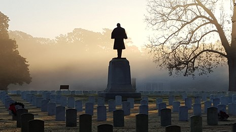

# Introduction to Visualizations
Digital Humanities Project at the University of South Florida

Our project will examine and analyze data visualizations pertaining to the layout and concentration of monuments and memorials related to the Civil War. By looking at these visualizations, we hope to find trends and patters in the locations and density of these dedicated monuments and memorials across the United States. We will gather data using Webscraper, clean and edit the data using Google OpenRefine, and then create visualizations by using Tableau.
