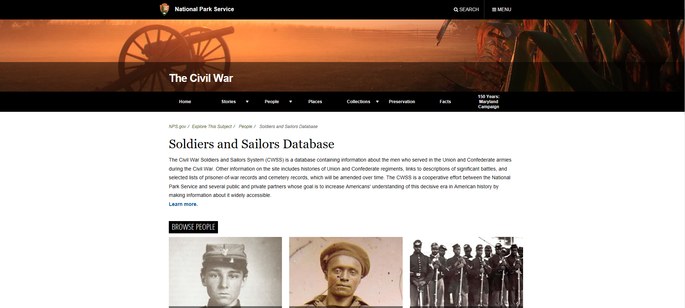

# Transparency Report

 
This is a report on the transparency of the database we gathered our data from, the National Park Service Soldiers and Sailors Database (NPS). Examining issues behind the collection of this data, the effects of third party funders and gatherers, the ease of finding the data, will show how transparent this database, and any database, is.
The database itself, has over 6.3 million records related to soldiers, sailors, battles, and prisoners of war, as well as records on cemeteries and monuments related to the Civil War. The database is located on the NPS website, and they are pretty transparent on where they gathered their sources and the process of transferring it to the database itself. Unfortunately, the NPS was not very clear on how the records were edited for accuracy and to what extent they were edited. The records were mainly gathered by volunteers of the NPS, who used sources like the General Index Cards in the Complied Military Service Records at the National Archives. The volunteers looked at these records in conjunction with many other documents related to Union and Confederate soldiers at the National Archives. The records were then edited for accuracy by the Genealogical Society of Utah and the Federation of Genealogical Societies. The NPS also sites other sources that were involved in the editing process, and also notes how the soldiers' names and other information were transferred to the online platform. So, while the NPS did disclose where and how it got the data for the database, it failed to adequately describe the editing process of the records.
Also, the nature and transparency of the database is determined by the overall goals and values of the NPS. This database does go along with the overall mission of the NPS, which is to "preserve unimpaired the natural and cultural resources and values of the National Park System for the enjoyment, education, and inspiration of this and future generations."  Because the database was design and the records gathered by the NPS, means the database is inherently biased towards the goals of the NPS, but it is still a valuable tool when starting a search through millions of records. Also, by cooperating with third party partners, the NPS database is further biased towards the goals of those third party institutions. The other institutions involved include the African American Civil War Memorial, Civil War Preservation Trust, the African American Civil War Sailors Project, United States Civil War Center, and the United Daughters of the Confederacy. Therefore, the goals of these institutions are reflected in the content and nature of the database, so if you are looking for records pertaining to the Civil War, this database is a good place to start, that has little, if any, negative biases attached to it.

Sources:
“Overview.” National Park Service U.S. Department of the Interior. Accessed 1 Nov. 2017. https://www.nps.gov/civilwar/soldiers-and-sailors-overview.htm.
